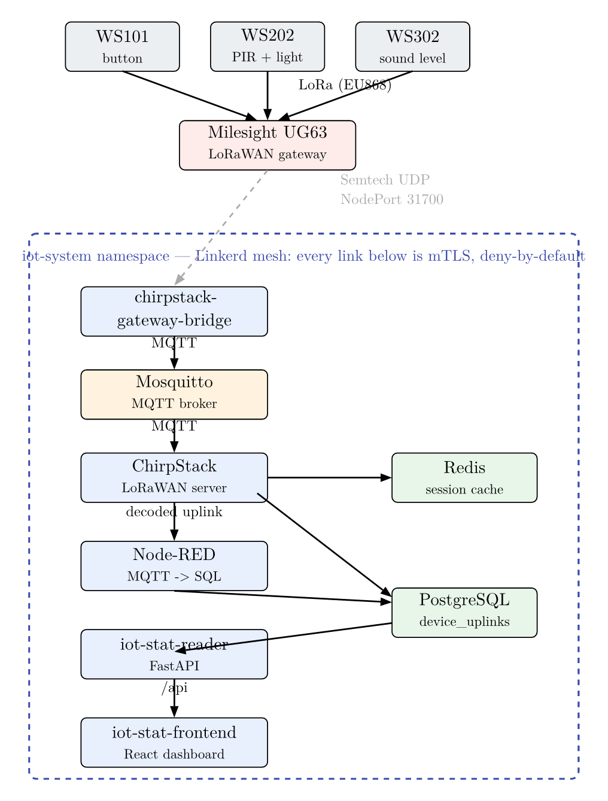
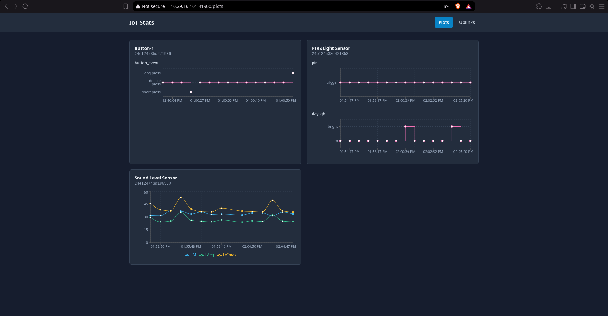
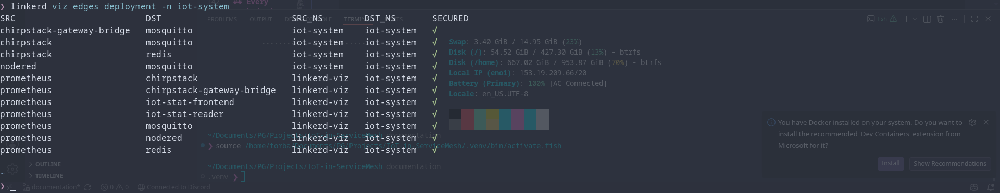

# IoT in a Service Mesh

> A LoRaWAN IoT data platform running on a self-hosted MicroK8s cluster, secured
> end-to-end with a **Linkerd** zero-trust service mesh and delivered entirely via
> **GitOps** with ArgoCD.

Physical Milesight LoRa sensors transmit to a gateway, which forwards their frames
into the cluster where they are decoded, stored, and visualised. The distinguishing
goal of the project is not just to make the pipeline work, but to run it inside a
zero-trust mesh: **every pod-to-pod connection is mutually authenticated and encrypted
with mTLS, and every service is denied by default** unless an explicit authorization
policy allows a specific client identity. The whole platform is declarative — described
in Git, reconciled by ArgoCD, and rebuildable from scratch with a single `make` target.



## Table of contents

- [Architecture](#architecture)
- [Technology stack](#technology-stack)
- [Repository layout](#repository-layout)
- [Prerequisites](#prerequisites)
- [Quick start](#quick-start)
- [Make targets](#make-targets)
- [Configuration](#configuration)
- [Applications](#applications)
- [Zero-trust security model](#zero-trust-security-model)
- [Observability](#observability)
- [Verifying mTLS and the deny-by-default policy](#verifying-mtls-and-the-deny-by-default-policy)
- [Documentation](#documentation)

## Architecture

End-to-end data flow:

```
 Milesight sensors (LoRa radio)
        │
        ▼
 Milesight UG63 gateway
        │  Semtech UDP packet-forwarder → NodePort 31700/UDP
        ▼
 chirpstack-gateway-bridge ──MQTT──► mosquitto ──MQTT──► chirpstack
                                                            │  decode frame (JS codec)
                                                            ▼
                                          application uplink on MQTT topic
                                                            │
                                                            ▼
                                                        Node-RED  (subscribes)
                                                            │  INSERT
                                                            ▼
                                                       PostgreSQL  (device_uplinks)
                                                            ▲
                                                            │  SELECT / LISTEN
                                            iot-stat-reader (FastAPI)
                                                            ▲
                                                            │  /api  (nginx proxy)
                                            iot-stat-frontend (React)
```

Every arrow that crosses a pod boundary inside the cluster is transparently wrapped in
mutual TLS by the Linkerd proxy, and is permitted only because an explicit authorization
policy allows that specific client identity.

### The cluster

MicroK8s (Canonical's lightweight, snap-packaged Kubernetes) provisioned by Ansible
across four VMs:

| Host       | Address         | Role                                          |
| ---------- | --------------- | --------------------------------------------- |
| `cp-node`  | `10.29.16.101`  | Control plane (also schedules workloads)      |
| `worker-1` | `10.29.16.102`  | Worker node                                   |
| `worker-2` | `10.29.16.103`  | Worker node                                   |
| `load-gen` | `10.29.16.104`  | k6 load generator (testing, off-cluster)      |

Enabled add-ons: `dns` (CoreDNS), `hostpath-storage` (PVCs for PostgreSQL and Node-RED),
and the `community` repository. The **Gateway API CRDs** are installed as a prerequisite
for Linkerd's policy stack. All application workloads live in the `iot-system` namespace;
ArgoCD runs in `argocd`, and Linkerd in `linkerd` / `linkerd-viz`.

## Technology stack

| Component                  | Role                                                       | Layer       |
| -------------------------- | ---------------------------------------------------------- | ----------- |
| MicroK8s                   | Lightweight Kubernetes (control plane + 2 workers)         | Platform    |
| Linkerd                    | Service mesh: mTLS, identity, zero-trust authorization     | Mesh        |
| Linkerd Viz                | Observability: Prometheus metrics, Tap, dashboard          | Mesh        |
| ArgoCD                     | GitOps continuous delivery — reconciles all apps from Git  | Delivery    |
| ChirpStack (v4)            | LoRaWAN Network + Application Server                        | Application |
| ChirpStack Gateway Bridge  | Translates Semtech UDP packet-forwarder ↔ MQTT             | Application |
| Mosquitto                  | MQTT broker between gateway-bridge and ChirpStack          | Application |
| PostgreSQL / Redis         | ChirpStack persistence and device-session cache            | Data        |
| Node-RED                   | Flow engine: MQTT → decode → PostgreSQL                    | Application |
| iot-stat-reader            | FastAPI backend exposing the stored uplinks                | Application |
| iot-stat-frontend          | React + Tailwind dashboard (plots + table)                 | Application |
| Ansible + Make             | Automation: provision, deploy, tear down, bootstrap devices| Automation  |

## Repository layout

```
.
├── Makefile                     # one-command provisioning / deploy / teardown
├── apps/                        # application source code
│   ├── iot-stat-reader/         # FastAPI backend (asyncpg, SSE stream)
│   ├── iot-stat-frontend/       # React + Vite + Tailwind dashboard
│   └── nodered/                 # Node-RED flow export (flows.json)
├── infrastructure/
│   ├── inventory.ini            # Ansible inventory (the 4 VMs)
│   ├── setup-microk8s.yaml      # provision the MicroK8s cluster over SSH
│   ├── playbooks/               # setup-all, teardown, bootstrap-chirpstack, ...
│   ├── manifests/               # Kubernetes manifests, one dir per service
│   │   ├── bootstrap/           # iot-system namespace (deny-by-default)
│   │   ├── chirpstack/ mqtt/ nodered/ iot-stat-reader/ iot-stat-frontend/
│   │   └── observability/       # Linkerd Viz authorization policy
│   ├── argocd/apps.yaml         # ArgoCD Application definitions
│   ├── chirpstack/              # device bootstrap (devices.yaml + JS decoders)
│   └── scripts/                 # nodered-export.sh, ...
├── documentation/               # Typst sources, rendered PDFs, images
├── Analytics/                   # capacity / cost calculations (Typst)
└── tools/udp_relay.py           # helper for forwarding gateway UDP traffic
```

## Prerequisites

Installed locally (on the machine that drives the deployment):

- `kubectl` — configured to talk to the cluster locally (no SSH/manifest-copy to the
  control plane).
- [`linkerd`](https://linkerd.io/2/getting-started/) CLI (auto-detected; override with
  `LINKERD=...`).
- `ansible-playbook` (provided in the project `.venv`).
- An SSH key with root access to the four VMs (for the cluster-provisioning step only).

The target VMs need outbound network access and Ubuntu with snap available (MicroK8s is
installed via snap by the Ansible playbooks).

## Quick start

```bash
# 1. Populate secrets (see Configuration below) in a .env at the repo root

# 2. Provision the cluster, install the mesh + ArgoCD, sync all services,
#    and bootstrap the ChirpStack tenant/devices — one command:
make setup_everything
```

Or run the phases individually:

```bash
make setup_mk8s            # provision MicroK8s on the VMs (over SSH)
make set_all_up            # install Linkerd + Viz + ArgoCD, register all Apps
make bootstrap_chirpstack  # create tenant, app, device profiles, gateway, devices
```

After `set_all_up`, ArgoCD continuously reconciles every service from this Git
repository (`dev` branch). Check progress with:

```bash
make status   # ArgoCD apps + iot-system pods + meshed edges
```

The first time uplinks need a home, create the table and the NOTIFY trigger the reader
streams from:

```bash
bash infrastructure/create_device_uplink_table.sh
bash infrastructure/create_uplink_notify_trigger.sh
```

## Make targets

| Target                        | What it does                                                            |
| ----------------------------- | ---------------------------------------------------------------------- |
| `make setup_everything`       | `setup_mk8s` → `set_all_up` → `bootstrap_chirpstack` (full platform)   |
| `make setup_mk8s`             | Provision MicroK8s cluster (nodes, add-ons, Gateway API CRDs), via SSH |
| `make set_all_up`             | Install Linkerd, Linkerd Viz, ArgoCD; register all Apps (runs locally) |
| `make teardown`               | Remove all services, ArgoCD, Linkerd Viz and Linkerd                   |
| `make status`                 | ArgoCD apps + `iot-system` pods + Linkerd mesh edges                   |
| `make nodered_export`         | Snapshot live Node-RED flows back into Git (sanitized)                 |
| `make bootstrap_chirpstack`   | Provision ChirpStack tenant/app/profiles/gateway/devices (`DRY_RUN=true` to preview) |

Binaries and paths are auto-detected and overridable on the command line, e.g.:

```bash
make set_all_up LINKERD=~/Tools/linkerd/bin/linkerd KUBECTL=kubectl
make setup_mk8s SSH_KEY=~/.ssh/id_rsa INVENTORY=infrastructure/inventory.ini
```

## Configuration

Secrets are read from a `.env` file at the repository root (git-ignored). It holds the
ChirpStack API token, the PostgreSQL credentials, and one LoRaWAN application key per
device (keyed by DevEUI):

```dotenv
CHIRPSTACK_API_SECRET=<chirpstack-api-token>
APPKEY_24E124535C271986=<appkey-hex>     # one per device DevEUI
POSTGRES_USER=chirpstack
POSTGRES_PASSWORD=chirpstack
POSTGRES_DB=chirpstack
```

Devices, device profiles, and the gateway are described declaratively in
[`infrastructure/chirpstack/devices.yaml`](infrastructure/chirpstack/devices.yaml);
`make bootstrap_chirpstack` applies them via the ChirpStack API. Payload codecs for each
Milesight model live in `infrastructure/chirpstack/decoders/`.

The Ansible inventory of cluster hosts is
[`infrastructure/inventory.ini`](infrastructure/inventory.ini).

## Applications

### iot-stat-reader (`apps/iot-stat-reader`)

A small FastAPI service (asyncpg connection pool) that exposes the stored LoRaWAN data
over HTTP. Endpoints include `/health`, `/tenants`, `/applications`, `/devices`,
`/devices/{dev_eui}`, `/gateways`, `/uplinks`, and `/uplinks/stream` — a Server-Sent
Events stream backed by a PostgreSQL `LISTEN`/`NOTIFY` channel (`new_uplink`) so the UI
updates live as frames arrive. Containerized from a multi-stage `python:3.12-slim` image.

### iot-stat-frontend (`apps/iot-stat-frontend`)

A React + Vite + Tailwind single-page dashboard (Recharts) that renders per-device plots
of numeric series and categorical events, plus a raw uplinks table. All requests go
through `/api`, proxied to the reader by nginx in production (or the Vite dev proxy
locally). Served from an nginx image that resolves the upstream via cluster DNS.



### Node-RED (`apps/nodered`)

The flow engine that subscribes to ChirpStack application uplinks on MQTT, normalises
the decoded payloads, and inserts them into the `device_uplinks` table. Flows are stored
as [`apps/nodered/flows.json`](apps/nodered/flows.json) and deployed via a ConfigMap; use
`make nodered_export` to snapshot live edits back into Git (sanitized).

## Zero-trust security model

The `iot-system` namespace is **deny-by-default**. Each service ships a Linkerd policy
(`linkerd-policy.yaml`) declaring a `Server` for its port and an `AuthorizationPolicy`
that only admits a named set of mesh identities via `MeshTLSAuthentication`. For example,
Mosquitto's MQTT port (1883, opaque/raw-TCP) accepts only the `mqtt-client`,
`chirpstack`, `chirpstack-gateway-bridge`, and `node-red` service-account identities —
any other identity is rejected at the connection level even though mTLS itself succeeds
(encryption/identity and authorization are separate layers).

Only five services are intended to be externally reachable: `gateway-bridge-udp`,
`chirpstack-ui`, `nodered-ui`, `iot-stat-reader-ui`, and `iot-stat-frontend-ui`.



## Observability

Linkerd Viz provides Prometheus metrics, live request Tap, and a dashboard:

```bash
linkerd viz dashboard &                       # open the web UI
linkerd viz edges deployment -n iot-system    # show meshed (mTLS) edges
linkerd viz authz -n iot-system deploy/iot-stat-reader   # per-policy allow/deny stats
```

## Verifying mTLS and the deny-by-default policy

`CHEATSHEET.md` (kept local, git-ignored) contains worked, copy-pasteable proofs:

- **Proof A** — capture frames on the wire to show the payload is cleartext only between
  app and its local proxy (`lo`, port 1883) and TLS-encrypted the moment it leaves the
  pod (`eth0`, port 4143).
- **Proof B** — an unauthorized identity is rejected even though mTLS is established
  (deny-by-default), visible in the destination proxy's denial logs and deny counters.
- **Proof C** — Linkerd's own attestation via `tap` / `edges` / `authz` showing
  `tls=true`, the verified client identity, and the authorizing policy per request.

## Documentation

Full write-ups are authored in [Typst](https://typst.app/) under `documentation/` and the
repository root, with rendered PDFs and screenshots:

- `project-documentation.typ` — architecture, mesh design, and rationale
- `argocd-setup.typ`, `chirpstack-setup.typ`, `nodered-setup.typ`,
  `linkerd-viz-setup.typ` — per-component setup guides
- `documentation/main.typ` / `main-pl.typ` — full report (English / Polish)
- `Analytics/calc_sheet.typ` — capacity / cost calculations


